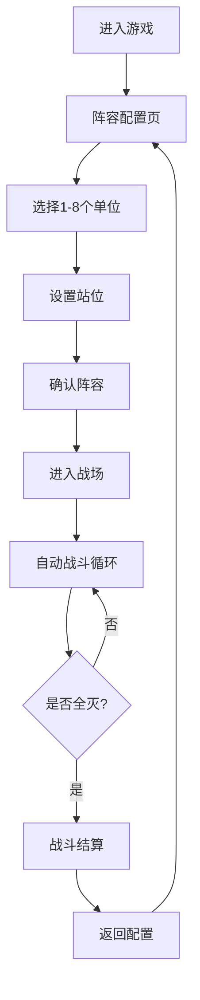

## 1. 产品概述

浏览器战棋游戏——玩家配置1-8个单位组成阵容，两两对战自动战斗。包含地图障碍、移动寻路、技能CD、Buff叠加与仇恨系统，提供策略深度与视觉观赏性。

- 目标用户：喜欢策略战棋的休闲/中度玩家
- 核心价值：零门槛配置阵容 + 观赏自动对战的策略博弈体验

## 2. 核心功能

### 2.1 功能模块

1. **阵容配置页**：选择1-8个单位、设置站位、查看属性与技能
2. **战场页**：自动战斗可视化，含地图、单位移动、技能释放、Buff效果、仇恨指示

### 2.2 页面详情

| 页面名称 | 模块名称 | 功能描述 |
|----------|----------|----------|
| 阵容配置页 | 单位列表 | 展示可选单位卡片，含职业、属性、技能描述 |
| 阵容配置页 | 阵容编辑区 | 拖拽/点击将1-8个单位放入阵容槽位，预览站位 |
| 阵容配置页 | 属性面板 | 选中单位后显示详细属性、技能CD、被动效果 |
| 阵容配置页 | 开始战斗按钮 | 确认阵容后进入战斗 |
| 战场页 | 地图区域 | 网格地图，含障碍物、地形、单位棋子 |
| 战场页 | 战斗日志 | 实时滚动显示战斗事件（攻击、技能、Buff、仇恨变化） |
| 战场页 | 单位信息面板 | 悬停/点击单位显示HP、MP、Buff列表、仇恨目标 |
| 战场页 | 战斗控制 | 播放/暂停、调速（1x/2x/4x）、重新开始 |

## 3. 核心流程

玩家打开游戏 → 在阵容配置页选择1-8个单位并设置站位 → 点击"开始战斗" → 进入战场页 → 两方阵容自动战斗（寻路移动→仇恨锁定→技能/普攻→Buff结算→循环） → 一方全灭则战斗结束 → 显示结算面板 → 可返回重新配置

## 4. 用户界面设计

### 4.1 设计风格

- **主色调**：深色军事风 — 深灰底(#1a1a2e) + 暗红强调(#e94560) + 金色点缀(#f0c040)
- **次色调**：蓝方(#4ea8de) vs 红方(#e94560) 对抗色
- **按钮风格**：圆角微凸3D按钮，带光影与hover动效
- **字体**：标题用 Orbitron（科幻军事风），正文用 Noto Sans SC
- **布局**：左侧主战场区域，右侧信息面板；配置页为居中卡片布局
- **图标风格**：像素风/简笔画战争图标

### 4.2 页面设计概览

| 页面名称 | 模块名称 | UI元素 |
|----------|----------|--------|
| 阵容配置页 | 单位列表 | 卡片网格，每张卡片含角色头像、职业图标、属性条 |
| 阵容配置页 | 阵容编辑区 | 8个槽位水平排列，点击添加/移除单位，可拖拽排序 |
| 阵容配置页 | 属性面板 | 右侧滑出面板，数值条形图展示各属性 |
| 战场页 | 地图区域 | Canvas绘制网格地图，单位为带颜色标记的棋子，障碍为深色块 |
| 战场页 | 战斗日志 | 底部半透明滚动日志，按类型着色（攻击红/技能金/Buff绿/仇恨橙） |
| 战场页 | 单位信息面板 | 右侧固定面板，HP/MP条、Buff图标列表、仇恨目标箭头 |
| 战场页 | 战斗控制 | 底部居中控制条，播放/暂停/调速按钮 |

### 4.3 响应式

- 桌面优先设计（1920x1080最佳体验）
- 平板适配：地图区域缩放，信息面板折叠为悬浮窗
- 手机：简化视图，地图占满屏幕，面板通过底部标签页切换

## 5. 游戏系统详细设计

### 5.1 单位职业

| 职业 | 定位 | 基础HP | 基础ATK | 移动力 | 攻击范围 | 特殊 |
|------|------|--------|---------|--------|----------|------|
| 战士 | 前排坦克 | 120 | 15 | 2 | 1 | 仇恨值+50% |
| 骑士 | 前排防御 | 110 | 12 | 3 | 1 | 护盾技能 |
| 弓手 | 后排输出 | 60 | 20 | 2 | 4 | 远程优先 |
| 法师 | 后排输出 | 50 | 25 | 2 | 3 | AOE技能 |
| 刺客 | 突袭 | 70 | 22 | 4 | 1 | 高移速高暴击 |
| 牧师 | 治疗 | 55 | 8 | 2 | 3 | 治疗友方 |
| 术士 | 诅咒 | 65 | 18 | 2 | 3 | DOT/Buff诅咒 |

### 5.2 技能系统

- 每个单位拥有1个普攻 + 1-2个主动技能
- 技能CD：施放后进入冷却，CD回合数各不相同
- 部分技能附带Buff/Debuff效果

### 5.3 Buff系统

- Buff可叠加层数，每层独立计时
- 同名Buff叠加层数而非重复挂载
- Buff类型：增伤/减伤/持续伤害/持续治疗/护盾/减速/嘲讽

### 5.4 仇恨系统

- 每个单位维护一个仇恨表（对敌方每个单位的仇恨值）
- 仇恨值来源：受到伤害+10、被治疗+5、距离近+2/回合
- 仇恨衰减：每回合所有仇恨值-5%（最低0）
- 自动攻击仇恨值最高的敌方单位
- 战士职业被动：受到攻击时额外产生+50%仇恨

### 5.5 地图与障碍

- 地图尺寸：12x10 网格
- 障碍类型：石墙（不可通过不可穿越）、水域（不可通过可远程穿越）
- 每场战斗随机生成障碍分布
- 双方单位分别部署在地图左右两侧
