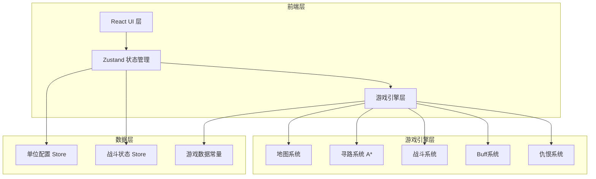
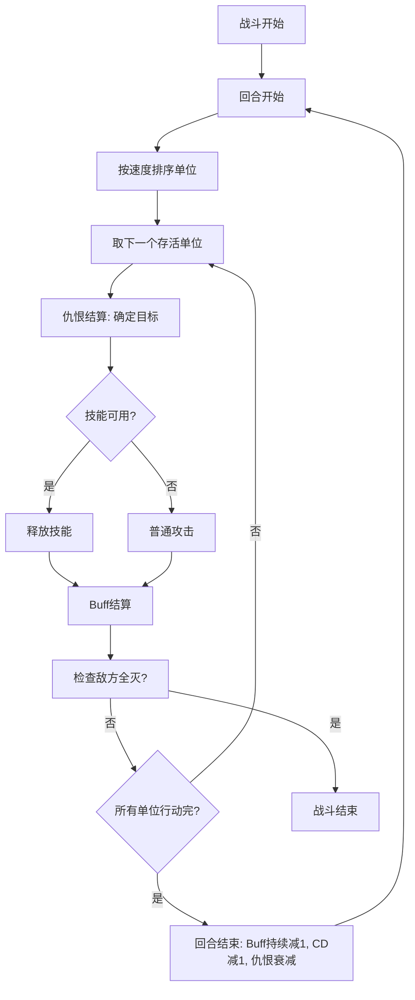

## 1. 架构设计



## 2. 技术说明

- **前端**：React@18 + TypeScript + Tailwind CSS@3 + Vite
- **状态管理**：Zustand（管理阵容配置、战斗状态、游戏设置）
- **渲染**：Canvas 2D 绘制战场地图与单位（性能优于DOM渲染大量棋子）
- **寻路算法**：A* 算法，支持障碍物避让
- **后端**：无（纯前端游戏）
- **数据库**：无（使用内存状态 + 常量数据）

## 3. 路由定义

| 路由 | 用途 |
|------|------|
| / | 阵容配置页 - 选择和编排1-8个单位 |
| /battle | 战场页 - 自动战斗可视化 |

## 4. 核心数据结构

### 4.1 单位数据模型

```typescript
interface Unit {
  id: string
  name: string
  class: UnitClass
  team: 'blue' | 'red'
  hp: number
  maxHp: number
  mp: number
  maxMp: number
  atk: number
  def: number
  speed: number
  moveRange: number
  attackRange: number
  pos: { x: number; y: number }
  skills: Skill[]
  buffs: Buff[]
  aggroTable: Map<string, number>
  isAlive: boolean
}

type UnitClass = 'warrior' | 'knight' | 'archer' | 'mage' | 'assassin' | 'priest' | 'warlock'

interface Skill {
  id: string
  name: string
  type: 'damage' | 'heal' | 'buff' | 'debuff' | 'aoe'
  value: number
  range: number
  cd: number
  currentCd: number
  buffEffect?: BuffEffect
  aoeRadius?: number
}

interface BuffEffect {
  name: string
  type: 'atkUp' | 'defUp' | 'atkDown' | 'defDown' | 'dot' | 'hot' | 'shield' | 'slow' | 'taunt'
  value: number
  duration: number
  stackable: boolean
}

interface Buff {
  name: string
  type: BuffEffect['type']
  value: number
  remainingTurns: number
  stacks: number
  sourceUnitId: string
}

interface GameMap {
  width: number
  height: number
  tiles: TileType[][]
}

type TileType = 'plain' | 'wall' | 'water'
```

### 4.2 战斗状态模型

```typescript
interface BattleState {
  phase: 'idle' | 'running' | 'paused' | 'finished'
  turn: number
  currentUnitIndex: number
  units: Unit[]
  map: GameMap
  logs: BattleLog[]
  winner: 'blue' | 'red' | null
  speed: 1 | 2 | 4
}

interface BattleLog {
  turn: number
  unitId: string
  type: 'attack' | 'skill' | 'move' | 'buff' | 'aggro' | 'death'
  message: string
}
```

## 5. 战斗引擎流程



### 5.1 寻路算法

使用 A* 算法：
- 开放列表使用最小堆优化
- 代价函数：f(n) = g(n) + h(n)，h 使用曼哈顿距离
- 墙壁(wall)和友方单位占据的格子不可通行
- 水域(water)不可进入但可远程攻击穿越
- 移动范围限制：每个单位有 moveRange 属性

### 5.2 仇恨算法

```
每回合:
  for each unit:
    for each enemy:
      aggro[enemy] *= 0.95  // 衰减5%
    
    // 距离加成
    for each enemy within attackRange:
      aggro[enemy] += 2

受到伤害时:
  aggro[attacker] += damage * 0.5

被治疗时:
  aggro[healer] += healAmount * 0.3  // 如果是友方

战士被动:
  受到伤害时额外 aggro[attacker] += damage * 0.25

目标选择:
  target = enemy with max aggro value
```

## 6. 文件结构

```
src/
  components/
    BattleMap.tsx          // Canvas战场渲染
    BattleControls.tsx     // 播放/暂停/调速
    BattleLog.tsx          // 战斗日志
    UnitInfoPanel.tsx      // 单位详情面板
    UnitCard.tsx           // 单位配置卡片
    FormationSlot.tsx      // 阵容槽位
  pages/
    SetupPage.tsx          // 阵容配置页
    BattlePage.tsx         // 战场页
  engine/
    pathfinding.ts         // A*寻路
    battle.ts              // 战斗循环引擎
    aggro.ts               // 仇恨系统
    buff.ts                // Buff系统
    mapGenerator.ts        // 地图生成器
  store/
    useGameStore.ts        // 全局状态管理
  data/
    units.ts               // 单位基础数据
    maps.ts                // 地图模板
  types/
    index.ts               // TypeScript类型定义
```
